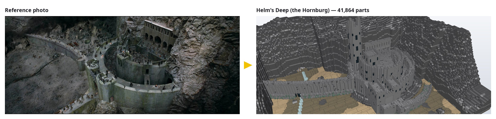
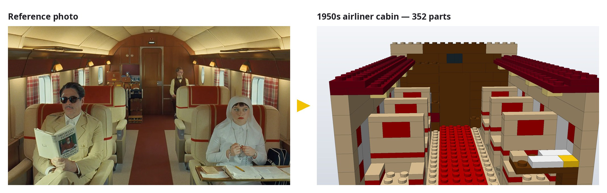
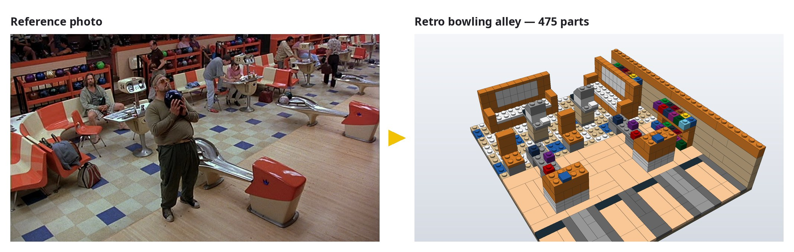
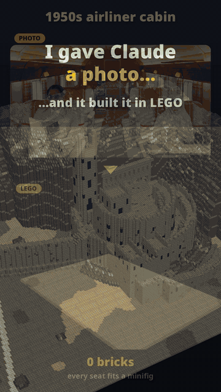
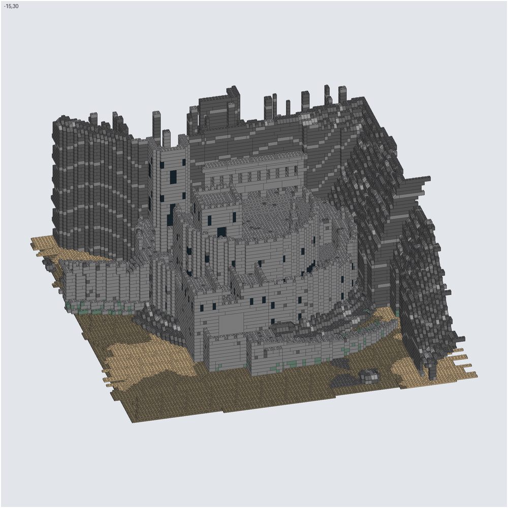

# brickbuilder-mcp

**Show Claude a photo, get a buildable LEGO model back.**

An MCP server that lets Claude design LEGO models brick by brick, usually from a
reference picture, check that they actually hold together, and export them as LDraw
`.ldr` files that [Mecabricks](https://www.mecabricks.com) and
[BrickLink Studio](https://www.bricklink.com/v3/studio/download.page) open directly.



## What it looks like

Every build below was made by Claude through this server from the photo on the left.
Nothing was placed by hand.





<p align="center"></p>

The models are real, buildable LEGO: standard parts in real colours, bricks laid in
staggered courses, and a connectivity check that flags anything floating before export.

## Setup

Needs Python 3.11+, [uv](https://docs.astral.sh/uv/), `curl` and `unzip`.

```bash
git clone https://github.com/ElRashoMacuin24/brickbuilder-mcp.git
cd brickbuilder-mcp
scripts/fetch_ldraw.sh   # downloads the LDraw parts library (~145 MB zip) into data/ldraw
uv sync
claude mcp add brickbuilder -s user -- uv --directory "$PWD" run brickbuilder-mcp
```

Restart Claude Code, then run `/mcp` and check that `brickbuilder` is listed.
Other MCP clients work too: run `uv --directory /path/to/brickbuilder-mcp run brickbuilder-mcp` over stdio.

## How to use it

### 1. Give Claude a picture and a goal

Paste or drag an image into Claude Code (or give a path) and say what you want.
The more you say about scale, the better:

> Build this scene in LEGO without the people. Make it minifig scale, so the chairs
> are just big enough for a minifig to sit in.

> Build this house in LEGO, about 16 studs wide: ~/Pictures/house.jpg

> Make a 48×48 flat mosaic of this logo: ~/Pictures/logo.png

Useful things to specify:

- **Scale**: "minifig scale" (doors, seats and stairs sized for minifigures),
  "microscale", or a size in studs ("about 32 studs wide").
- **What to leave out**: people, background, text.
- **Colours**: "use only common colours" keeps it cheap to build for real.

### 2. Let it work, then steer

Claude plans the scale, builds bottom-up, renders previews next to your photo and
fixes what doesn't match. Ask for changes in plain language:

> The orange is too brown, use a redder shade.
> Make the tower taller and add windows.
> The left rack is hidden behind the bench, move it.

### 3. Export and open it

When you're happy, ask Claude to export. The file lands in `exports/<name>.ldr`.

- **Mecabricks**: Workshop → File → Import → LDraw, then pick the file. You can publish it to the
  Mecabricks gallery from there.
- **BrickLink Studio**: File → Import → Import LDraw. Studio also gives you a parts list and
  prices to buy the bricks. It handles very large models better than a browser tab.

If Mecabricks shows missing parts, ask Claude to re-export with `legacy_ids` (older part
numbers such as `3023` instead of `3023b`).

### 4. Pick it up later, on any computer

Models autosave to `models/<name>.json`. Say "open the bowling alley model" in a later
session to keep editing. Copy `models/` and `exports/` to another machine to take your
builds with you.

## Tools

| Tool | Purpose |
|---|---|
| `new_model` / `open_model` / `list_models` | Models autosave to `models/*.json` |
| `list_parts`, `list_colors` | Curated catalog, full LDraw library search, colour codes |
| `add_parts`, `remove_parts`, `undo` | Place parts on the stud grid, with collision checks |
| `fill_layers` | Colour layer maps packed automatically into bricks/plates/tiles in running bond |
| `image_to_grid`, `build_mosaic` | Quantize pictures to LEGO colours; build mosaics |
| `describe_model`, `check_model` | Per-level maps, part counts, floating/loose-part detection |
| `render_model` | Preview sheet (iso/front/top/etc.), optionally beside the reference picture |
| `export_ldr` | LDraw file, one build step per level; `legacy_ids` for older part numbers |

### Grid

- `x`: studs to the right; `z`: studs toward the back (z=0 is the front); `y`: plates up (brick = 3).
- A part's position is the min corner of its body after rotation.
- `rot` 0/90/180/270 (or front/right/back/left). A slope's sloped face points
  that way. At rot 0 a 2x4 brick is 4 studs long in x.

### Notes

- Any LDraw part can be placed. Parts outside the curated catalog are handled
  as their bounding box for collisions, connectivity and previews. The exported
  file always uses the real part.
- Previews are simplified geometry: round parts and arches show as boxes.

## Very large builds



Placing tens of thousands of parts one tool call at a time doesn't scale, so for
Helm's Deep (192 × 160 studs, 41,864 parts) Claude wrote a generator instead.
`scripts/helms_deep/` contains it:

- `gen.py` designs the scene as a colour voxel grid (terrain, walls, stairs, towers) and
  hollows it into a supported shell.
- `slopes.py` adds 45° slopes along the rock ledges.
- `pack.py` packs everything into staggered bricks and plates, then repairs any floating groups.

```bash
uv run python scripts/helms_deep/gen.py
uv run python scripts/helms_deep/slopes.py
uv run python scripts/helms_deep/pack.py
```

Then ask Claude to `open_model helms_deep` and export it.

## Showcase renders and video

`scripts/showcase/` has a GPU renderer (OpenGL via moderngl) for nicer images than the
built-in previews, plus the scripts that made the pictures on this page:

```bash
uv run --with moderngl python scripts/showcase/glrender.py helms_deep out.png   # one image
uv run --with moderngl python scripts/showcase/compare.py                       # photo vs build
uv run --with moderngl python scripts/showcase/video.py                         # 9:16 build video
```

`compare.py` and `video.py` read reference photos from `scripts/showcase/refs/`. That
folder isn't in the repo, so put your own photos there. `video.py` needs `ffmpeg`.

## Safety

The server runs locally over stdio and makes no network requests (only
`scripts/fetch_ldraw.sh` downloads, from library.ldraw.org). Tool inputs are
treated as untrusted:

- Part ids must be plain LDraw names; library lookups can't leave `data/ldraw`.
- Image tools only open picture files (`.png`, `.jpg`, …) and refuse decompression bombs.
- `export_ldr` only writes `.ldr` / `.mpd` files; models are saved under `models/`
  with sanitised names.
- Render size, grid size and parts per call are capped so one call can't exhaust memory.

It does read picture paths and write `.ldr` files wherever the MCP client asks, with
your user's permissions, so review tool calls as you would any other file access.

## Credits and licence

Code: MIT (see `LICENSE`). Parts geometry comes from the
[LDraw parts library](https://www.ldraw.org), which is downloaded separately and is
licensed CC BY 2.0 by its authors; it is not included in this repository.

The reference stills shown next to the builds are from *The Phoenician Scheme* (2025),
*The Big Lebowski* (1998) and *The Lord of the Rings: The Two Towers* (2002). They are
shown small, for comparison only, and remain the property of their owners.

LEGO® is a trademark of the LEGO Group, which does not sponsor or endorse this project.
