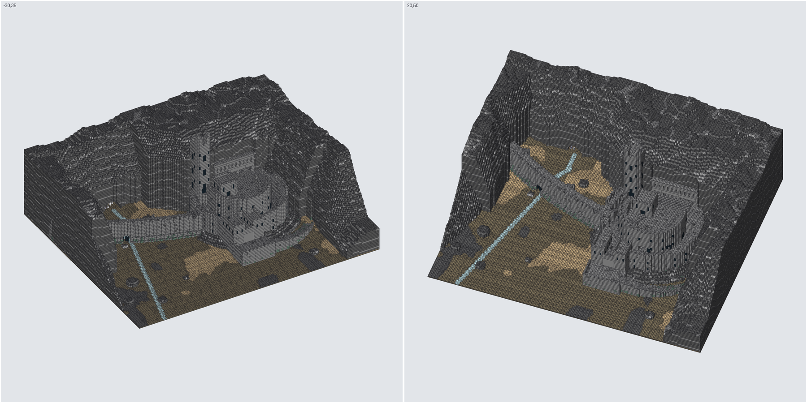

# brickbuilder-mcp

An MCP server that lets Claude design LEGO models brick by brick, often from a
reference picture, and export them as LDraw `.ldr` files that
[Mecabricks](https://www.mecabricks.com) (Workshop → File → Import → LDraw) and
BrickLink Studio can open.



## Setup

Needs Python 3.11+, [uv](https://docs.astral.sh/uv/), `curl` and `unzip`.

```bash
git clone https://github.com/ElRashoMacuin24/brickbuilder-mcp.git
cd brickbuilder-mcp
scripts/fetch_ldraw.sh   # downloads the LDraw parts library (~145 MB zip) into data/ldraw
uv sync
claude mcp add brickbuilder -s user -- uv --directory "$PWD" run brickbuilder-mcp
```

Restart Claude Code, then check `/mcp` lists `brickbuilder`. Models are saved in
`models/` and exports in `exports/`; set `BRICKBUILDER_HOME` to keep them elsewhere,
or `LDRAW_DIR` to use an existing LDraw library.

## Using it

Give Claude a picture and ask it to build it, e.g.
"Build this house in LEGO, about 16 studs wide: ~/Pictures/house.jpg".
Claude will look at the image, build the model with the tools below, render
previews to compare against the picture, and export to `exports/<name>.ldr`.

| Tool | Purpose |
|---|---|
| `new_model` / `open_model` / `list_models` | Models autosave to `models/*.json` |
| `list_parts`, `list_colors` | Curated catalog, full LDraw library search, colour codes |
| `add_parts`, `remove_parts`, `undo` | Place parts on the stud grid, with collision checks |
| `fill_layers` | Colour layer maps packed automatically into bricks/plates/tiles in running bond |
| `image_to_grid`, `build_mosaic` | Quantize pictures to LEGO colours; build mosaics |
| `describe_model`, `check_model` | Per-level maps, part counts, floating/loose-part detection |
| `render_model` | Preview sheet (iso/front/top/etc.), optionally beside the reference picture |
| `export_ldr` | LDraw file, one build step per level; `legacy_ids` for older part numbers |

### Grid

- `x`: studs to the right; `z`: studs toward the back (z=0 is the front); `y`: plates up (brick = 3).
- A part's position is the min corner of its body after rotation.
- `rot` 0/90/180/270 (or front/right/back/left). A slope's sloped face points
  that way. At rot 0 a 2x4 brick is 4 studs long in x.

### Notes

- Any LDraw part can be placed. Parts outside the curated catalog are handled
  as their bounding box for collisions, connectivity and previews. The exported
  file always uses the real part.
- Previews are simplified geometry: round parts show as boxes.
- If Mecabricks shows parts as missing after import, re-export with
  `legacy_ids=True` (e.g. `3023` instead of `3023b`).

## Examples

| | |
|---|---|
|  |  |

`scripts/helms_deep/` shows how to go beyond hand placement for very large builds:
`gen.py` designs the scene as a colour voxel grid (terrain, walls, stairs, towers),
hollows it into a supported shell, `slopes.py` adds 45° slopes on rock ledges, and
`pack.py` packs everything into staggered bricks and plates and repairs any floating
groups. Run them in order with `uv run python scripts/helms_deep/<script>.py`, then
`open_model helms_deep` and `export_ldr` from Claude.

## Safety

The server runs locally over stdio and makes no network requests (only
`scripts/fetch_ldraw.sh` downloads, from library.ldraw.org). Tool inputs are
treated as untrusted:

- Part ids must be plain LDraw names; library lookups can't leave `data/ldraw`.
- Image tools only open picture files (`.png`, `.jpg`, …) and refuse decompression bombs.
- `export_ldr` only writes `.ldr` / `.mpd` files; models are saved under `models/`
  with sanitised names.
- Render size, grid size and parts per call are capped so one call can't exhaust memory.

It does read picture paths and write `.ldr` files wherever the MCP client asks, with
your user's permissions, so review tool calls as you would any other file access.

## Credits and licence

Code: MIT (see `LICENSE`). Parts geometry comes from the
[LDraw parts library](https://www.ldraw.org), which is downloaded separately and is
licensed CC BY 2.0 by its authors; it is not included in this repository.
LEGO® is a trademark of the LEGO Group, which does not sponsor or endorse this project.
